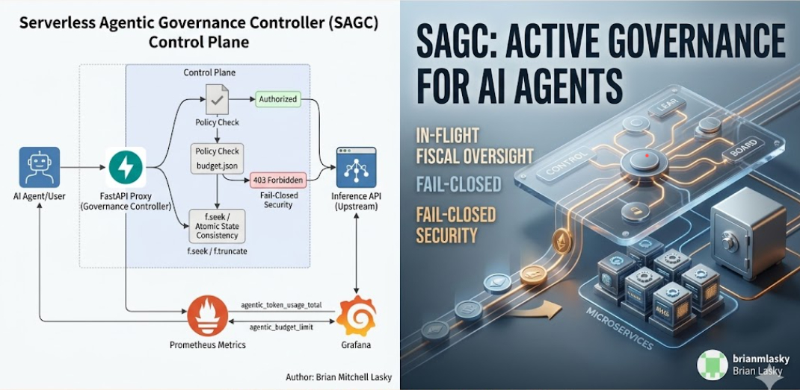

# Serverless Agentic Governance Controller (SAGC)


**Active governance and fiscal oversight for autonomous AI workloads.**

---

## Architecture Overview
The SAGC functions as an **Admission Control Middleware**, intercepting inference requests to validate fiscal authorization in real-time.



## Core Capabilities
* **Fail-Closed Security:** Defaults to blocking traffic if policy validation fails or the budget store is inaccessible.
* **Fiscal Observability:** Built-in Prometheus instrumentation provides real-time "Token Burn Rate" telemetry.
* **Atomic State Consistency:** Thread-safe, atomic I/O operations ensure budget integrity.
* **Policy-as-Code:** Governance logic is decoupled from business logic, allowing for Git-based auditing.

## Quick Start
```bash
# Install dependencies
make install

# Start the governance controller
make run

Resilience & Operational Readiness
This controller is designed for high-availability, cloud-native environments, reflecting enterprise-grade architectural standards.

Auditability: Budget states are persisted as version-controlled artifacts.

Scalability: Designed for sidecar container deployment within Kubernetes clusters.

Maintained by Brian Mitchell Lasky | Senior SRE
